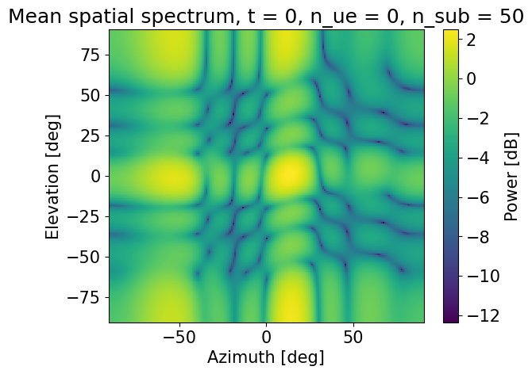

В данной работе предлагалось
1) исследовать различные методы пространственной согласующей фильтрации, влияние их выбора
 и выбора их параметров на BER(SNR) характеристику канала.

2) Ознакомиться с методы пространственной фильтрации

3) Ознакомиться с пилотными сигналами, изучить влияние ошибок при оценке канала на BER(SNR) характеристику

Задание 1)
Рассмотрим ситуацию, когда характеристическая функция канала полностью известна заранее

При условии, что у нас есть сигнал $s_0$, который мы хотим передать. Тогда, с учетом прекодера, влияния канала и шума итоговый сигнал 
$y = Hps + n$

Рассмотрим два прекодера: 
1) Равномерный: $p = \frac{1}{\sqrt(N)} [1 1 1 .. 1] ^T$
2) С использованием анализа сингулярных векторов: пусть $H_{MN} = U_{MM} \Sigma_{MN} V_{NN}^*$. Тогда, в качестве прекодера будут взяты $k$ векторов из $V$, соответствующих $k$ наибольшим сингулярным значениям, где $k$ - число битовых потоков.

Сравним их BER(SNR) характеристики при одном битовом потоке:

По уровню BER=0.1 примение прекодера с использованием SVD дает выигрыш в ~12-13 дБ

Добавим к данному графику случай, когда при использовании SVD прекодера передаюися два битовых потока:

Тут явно проявляется неравномерность действие канала на различные битовые потоки. Видно, что битовый поток №2 сильнее ослабевается каналом, чем битовый поток №1, так как BER(SNR) характеристика для того же SNR у него хуже

Для определения что выгодней использвовать, определим capacity:

$C = \Sigma_{i = 1}^{r}lg(1 + SNR \lambda_i \gamma_i / min (N, M))$,

Где $\gamma_i$ - сколько энергии выделяется на i-ый битовый поток

Получим картину:

То есть при равномерном распределении энергии между потоками, использовать два потока невыгодно

Задание 2)

Построим пространственный спектр H:

Воспользуемся методом векторов направлений:

$a_{\theta}(\theta) = (1, e^{-i 2 \pi 0.9 sin\theta }, ... e^{-i 2 (4 - 1) \pi 0.9 sin\theta })$

$a_{\phi}(\phi) = (1, e^{-i 2 \pi 0.9 sin\phi }, ... e^{-i 2 (4 - 1) \pi 0.9 sin\phi })$

Сформируем двумерный вектор направления:

$A(\theta, \phi) = a_{\phi}(\phi) \otimes a_{\theta}(\theta)$

Далее, фиксируем антенну пользователя, поднесущую, момент времени:

$h = H(k, t, m)$

Разбиваем данный вектор на два, отвечающих различным поляризациям

$h = \{h_{+}, h_{-}\}$

Тогда, мощность вычисляется как:

$\rho(\theta, \phi) = |h_{+}^{H}A(\theta, \phi) + h_{-}^{H}A(\theta, \phi)|^2$

Сравним получившиеся картины для разных принимающих антенн в нулевой момент времени и на нулевой поднесущей:

Можно увидеть, что они очень схожи между собой, поэтому можно усреднять картину по принимающим антеннам

Теперь, закрепим принимающую антенну, и посмотрим на картины на разных поднесущих:

Картины также слабо отличаются, поэтому далее будем усреднять по поднесущим

Рассмотрим картины в разные моменты времени

Канал меняется со временем, поэтому по времени лучше не усреднять. Далее, все картины будут для нулевого момента времени

Теперь, модифицируем алгоритм вычисления пространственного спектра мощности, добавив учет поляризации в вектор направлений:

$a_{\theta}^{+}(\theta) = (1, e^{-i 2 \pi 0.9 sin\theta }, ... e^{-i 2 (4 - 1) \pi 0.9 sin\theta })$

$a_{\phi}^{+}(\phi) = (1, e^{-i 2 \pi 0.9 sin\phi }, ... e^{-i 2 (4 - 1) \pi 0.9 sin\phi })$

$a_{\theta}^{-}(\theta) = e^{-i \frac{\pi}{2}}a_{\theta}^{+}(\theta)$

$a_{\phi}^{-}(\phi) = e^{-i \frac{\pi}{2}} a_{\phi}^{+}(\phi) $

$A(\theta, \phi)^{+} = a_{\phi}^{+}(\phi) \otimes a_{\theta}^{+}(\theta)$

$A(\theta, \phi)^{-} = a_{\phi}^{-}(\phi) \otimes a_{\theta}^{-}(\theta)$

$\rho(\theta, \phi) = |h_{+}^{H}A^{+}(\theta, \phi) + h_{-}^{H}A^{-}(\theta, \phi)|^2$

Сравним получившиеся картины без и с данной модификацией

Картина не претерпела существенных изменений, по мнению автора работы, можно использовать вектора направлений без учета множителя поляризации

Рассмотрим N-лучевую аппроксимацию канала

Для ее получения:
Рассмотрим вектор $h = H(m, k, t)$, полученный закрплением момента времени, поднесущей и пользовательской антенны,

Рассмотрим Фурье-образ данного вектора:
$\hat{h} = fft(h)$

Аппроксимация заключается в том, что оставляются лишь $N$ максимальных по модулю компонент и делается обратное преобразование Фурье

$h_{recovered} = ifft(\hat{h_{top N}}) $

Проделаем для каждого момента времени, поднесущей и антенны пользователя и получим полную N-лучевую аппроксимацию канала

Посмотрим на пространственные мощности при 64-, 8- и 1-лучевых аппроксимациях:

64 луча:

8 лучей:

1 луч:

Видно, что графики содержат меньше информации при уменьшении количества лучей

Построим на основе такой аппроксимации прекодер, и посмотрим на итоговые характеристики BER(SNR)

Из графика видно, что данный канал плохо аппроксимируется 1 лучом, но очень хорошо аппроксимируется 8 лучами.

Задание 3)

Теперь, рассмортрим ситуацию, когда мы не знаем канал. Используем посылаемые в uplink пилотные сигналы для оценки канала uplink, и воспользуемся $H_{downlinh} = H^{H}_{uplink}$ для установления оценки канала downlink

Если $s$ - отправленный пилот, а $y$ - принятый сигнал, то канал uplink на данной поднесущей можно оценить как

$h^{uplink}_{est} = ys^{*}$

И, канал downlink на данной поднесущей

$h^{downlink}_{est} = (h^{uplink}_{est}){H}$

В нашем случае, пользователь в uplink посылает пилотные сигналы на тех же поднесущих, на которых мы потом будем отправлять в downlink, поэтому интерполяции проводить не нужно

Используем полученную оценку для формирования SVD прекодера и рассмотрим BER(SNR) характеристики, полученные при наличие/отсутствие шума, наличие/отсутствие интерференции.

На высоких SNR оценка, полученная при наличие интерференции сильно отдаляется от идеальной, в отличие от оценки, полученной при наличие лишь шума. Примерно в середине рассматриваемых значений SNR оценка, полученная при наличие шума начинает проигрывать оценке, полученной при наличие интерференции, так как в импульсной характеристике шум начинает сравниваться по модулю со всплеском, полученном из-за интерференции

Рассмотрим импульсную характеристику пилотного сигнала с интерференцией:

Видно, что часть импульсной характеристики, которую мы и хотим оценить расположена достаточно локально (~20 отсчетов) и не пересекается с частью импульсной характеристики, характеризующую интерфереционный канал

Попробуем применять окно различных размеров на импульсную характеристику в разных сценариях (наличие/отсутствие шума, наличие/отсутствие интерференции)

На малых значениях окна мы отбрасываем часть информации из импульсной характеристики, связанной именно с нашим каналом. Поэтому здесь, даже на хороших SNR мы не достигаем идеальной оценки

При увеличении значения окна до 20, мы полностью соохраняем нужную информацию. Поэтому, при отсутсвии шума, оценка полностью совпадает с идельной.

Оценки, полученные путем применения окна при наличии шума и интерференции и только шума совпадают между собой, так как ошибки из-за интерференция полностью подавляются, и остается лишь влияние шума внутри отфильтрованной области

В предположении, что мы знаем хотя бы порядок максимальной задержки, можно предложить следующее в качестве стратегии подбора оптимальной длины окна: идем по модулю импульсной характеристики и смотрим на набор точек длиной в порядок максимальной задержки. Если все точки отличаются от среднего по данному промежутку не более чем на некий малый процент (5%, например), то мы считаем, что это уже все шум, и окно должно охватывать импульсную характеристику до данного отрезка 
