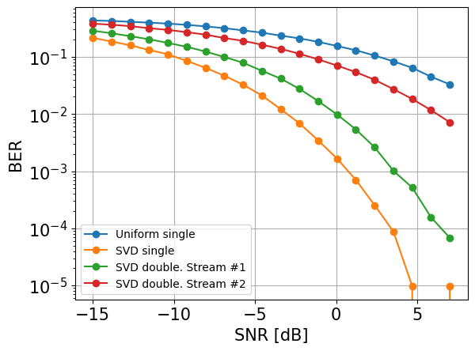

В данной работе предлагалось
1) исследовать различные методы пространственной согласующей фильтрации, влияние их выбора
 и выбора их параметров на BER(SNR) характеристику канала.

2) Ознакомиться с методы пространственной фильтрации

3) Ознакомиться с пилотными сигналами, изучить влияние ошибок при оценке канала на BER(SNR) характеристику

Задание 1)
Рассмотрим ситуацию, когда характеристическая функция канала полностью известна заранее

При условии, что у нас есть сигнал $ s_0 $, который мы хотим передать. Тогда, с учетом прекодера, влияния канала и шума итоговый сигнал 
$y = Hps + n$

Рассмотрим два прекодера: 
1) Равномерный: $p = \frac{1}{\sqrt(N)} [1 1 1 .. 1] ^T$
2) С использованием анализа сингулярных векторов: пусть $H_{MN} = U_{MM} \Sigma_{MN} V_{NN}^*$. Тогда, в качестве прекодера будут взяты $k$ векторов из $V$, соответствующих $k$ наибольшим сингулярным значениям, где $k$ - число битовых потоков.

Сравним их BER(SNR) характеристики при одном битовом потоке:

По уровню BER=0.1 примение прекодера с использованием SVD дает выигрыш в ~12-13 дБ

Добавим к данному графику случай, когда при использовании SVD прекодера передаюися два битовых потока:

Тут явно проявляется неравномерность действие канала на различные битовые потоки. Видно, что битовый поток №2 сильнее ослабевается каналом, чем битовый поток №1, так как BER(SNR) характеристика для того же SNR у него хуже

Задание 2)

Построим пространственный спектр H:

Рассмотрим влияние N-лучевой аппроксимацию канала при формировании SVD прекодера

